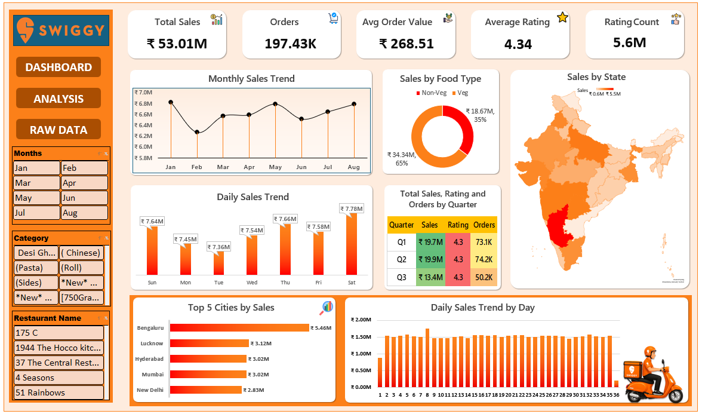

# 📊 Swiggy Sales Analytics Dashboard – Excel

An interactive Swiggy Sales Analytics Dashboard built in Microsoft Excel to analyze sales performance, orders, customer ratings, food preferences and geographic performance.

## 📸 Dashboard Preview

## 📥 Download the Interactive Excel Dashboard

[📊 Download Swiggy Sales Dashboard](./Swiggy_Sales_Dashboard.xlsx)

> Open the downloaded `.xlsx` file in Microsoft Excel to explore the interactive PivotTables, PivotCharts and Slicers.

## 📌 Project Overview

This project transforms raw Swiggy sales data into an interactive business dashboard using Excel data analysis and visualization techniques.

The dashboard provides a consolidated view of sales performance across different time periods, food types, states, cities and restaurants.

## 🛠️ Tools & Technologies

- Microsoft Excel
- PivotTables
- PivotCharts
- Slicers
- Excel Formulas
- Data Cleaning
- Data Analysis
- Data Visualization

## 📈 Dashboard Features

- Total Sales
- Total Orders
- Average Order Value
- Average Rating
- Rating Count
- Monthly Sales Trend
- Daily Sales Trend
- Daily Sales Trend by Day
- Sales by Food Type
- Sales by State
- Sales, Rating & Orders by Quarter
- Top 5 Cities by Sales
- Interactive Month, Category and Restaurant Name Slicers

## 🔍 Key Analysis

The dashboard helps analyze:

- Monthly sales performance
- Daily sales patterns
- Vegetarian vs Non-Vegetarian sales
- Quarterly sales and order performance
- State-wise sales distribution
- Top-performing cities
- Restaurant-level performance
- Customer rating patterns

## 🧮 Data Transformation

Additional analytical columns were created from the raw dataset, including:

- Food Type
- Day
- Quarter

These fields were used to support meaningful business analysis and dashboard visualizations.

## 📊 Key Metrics

| Metric | Value |
|---|---:|
| Total Sales | ₹53.01M |
| Total Orders | 197.43K |
| Average Order Value | ₹268.51 |
| Average Rating | 4.34 |
| Rating Count | 5.6M |

## 📁 Project Files

| File | Description |
|---|---|
| `Swiggy_Sales_Dashboard.xlsx` | Complete interactive Excel dashboard |
| `Dashboard_Preview.png` | Dashboard preview image |

## 🧩 Challenges Faced & Solutions

While building this dashboard, I faced a few challenges while working with the raw data and Excel visualizations.

### 1. Adding Food Type Classification

The raw dataset did not have a separate Veg/Non-Veg column, but I wanted to compare sales based on food type.

**How I solved it:** I created a `Food Type` column using `IF` and `OR` formulas. I used keywords such as Chicken, Egg, Fish, Mutton, Prawns, Biryani and Kebab to classify the dishes as Non-Veg; the remaining dishes were classified as Veg.

### 2. Creating Time-Based Analysis

The original date data was not enough for the different time-based views I wanted in the dashboard.

**How I solved it:** I created separate Month, Day and Quarter fields. This helped me analyze monthly, daily, weekly and quarterly sales trends.

### 3. Designing the Dashboard

It was challenging to fit KPIs, charts, a map, tables and slicers into one dashboard without making it look crowded.

**How I solved it:** I arranged the dashboard section by section and used consistent formatting, spacing and chart sizes to make the important information easier to read.

### 4. Slicer Formatting

One issue I faced was that the slicers looked different in size and text readability when I moved them from the Analysis sheet to the Dashboard.

**How I solved it:** I adjusted the slicer size, button height, number of columns and formatting to make them fit better with the dashboard layout.

### 5. Working with PivotTables and Aggregations

The raw data needed to be summarized before I could create meaningful charts and comparisons.

**How I solved it:** I used PivotTables and PivotCharts to summarize sales, orders, ratings, food types, states, cities and different time periods.

## 🎯 Learning Outcomes

Through this project, I practiced:

- Excel-based data analysis
- Data cleaning and transformation
- PivotTable creation
- PivotChart development
- Interactive slicer implementation
- Dashboard design
- Business-oriented data visualization
- Deriving insights from sales data

## 👤 Author

**Amit Kumar Paswan**

Aspiring Data Analyst

[LinkedIn](https://www.linkedin.com/in/iamitkumarprofile)

[GitHub](https://github.com/iamitkumarprofile)
